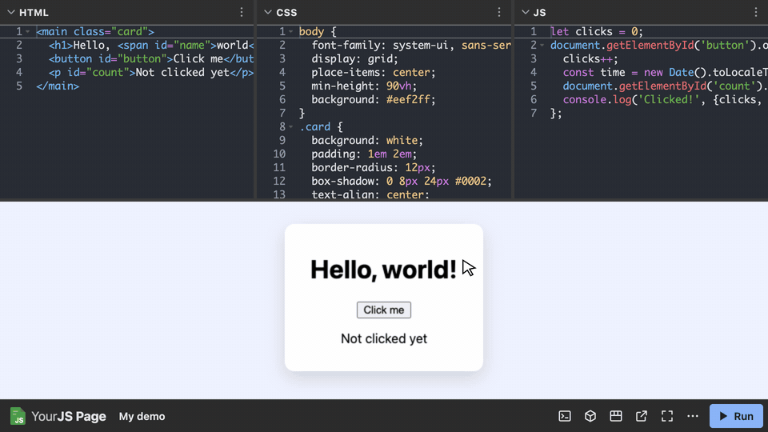

# YourJS Page


Embed a CodePen-like HTML, CSS and JavaScript playground on any web page with
one script tag.  Everything runs in the browser:  edit the code in the HTML,
CSS and JS editors, run it, and see the result (and what it logs) right away.

**[Live demo](https://westc.github.io/yourjs-page/)** &middot;
[Examples](https://westc.github.io/yourjs-page/#examples) &middot;
[Changelog](CHANGELOG.md)



## Usage

Add the script wherever you want the page to appear and tell it where to find
the starting code with CSS selectors:

```html
<div id="yourjs-page-wrapper" style="height: 600px;">
  <script src="https://cdn.jsdelivr.net/npm/yourjs-page@1/dist/yourjs-page.min.js"
          data-html-selector="pre#html-code > code"
          data-css-selector="pre#css-code > code"
          data-js-selector="pre#javascript-code > code"></script>
</div>

<pre id="html-code"><code>&lt;h1&gt;Hello, world!&lt;/h1&gt;</code></pre>
<pre id="css-code"><code>h1 { color: rebeccapurple; }</code></pre>
<pre id="javascript-code"><code>console.log('Hello from the result!');</code></pre>
```

The script is replaced by the page, which fills its container (and is at least
400px tall unless `data-height` is given).  The script is also available from
unpkg at `https://unpkg.com/yourjs-page@1/dist/yourjs-page.min.js`.

### Where the Code Comes From

Each selector finds the element with that language's code.  Only the first
match is used and the element can be anywhere in the page (even after the
script).  The code is the element's text, so HTML in a `<pre>` needs to be
escaped (eg. `&lt;h1&gt;`).  A `<template>` is handy for HTML because its HTML
is used as is and it isn't shown:

```html
<template id="html-code"><h1>Hello, world!</h1></template>
```

The code can also come from files with `data-html-url`, `data-css-url` and
`data-js-url`:

```html
<script src="https://cdn.jsdelivr.net/npm/yourjs-page@1/dist/yourjs-page.min.js"
        data-html-url="demo/index.html"
        data-css-url="demo/style.css"
        data-js-url="demo/script.js"></script>
```

Relative URLs are relative to the page.  Files on other sites can only be
loaded if the site allows it (with CORS), as GitHub's
`raw.githubusercontent.com` does.

The code can also come from a [gist](https://gist.github.com/) with
`data-gist` (the gist's URL or ID):

```html
<script src="https://cdn.jsdelivr.net/npm/yourjs-page@1/dist/yourjs-page.min.js"
        data-gist="https://gist.github.com/westc/2fe0bfa42237139860f32972ddc608f1"></script>
```

Unless `data-gist-html`, `data-gist-css` or `data-gist-js` names the file to
use, each language's file is found by its name:  `index.html` or else any
`.html` file, `style.css` (or `styles.css`) or else any `.css` file and
`script.js`, `index.js`, `main.js` or `app.js` or else any `.js` file.  A gist
doesn't need a file for every language.  The files are loaded from
`gist.githubusercontent.com`, which (unlike GitHub's API) doesn't limit how
many requests can be made.  They skip GitHub's cache (which keeps files for 5
minutes) so edits to a gist show up the next time the page is loaded.  If a file isn't named, the list of the gist's files
is loaded by adding a script from `gist.github.com` to the page (the same way
that GitHub's embedded gists work), so a page whose Content Security Policy
blocks that script should name each file.

Files and gists are loaded when the page is about to be scrolled into view
(see `data-loading`), and a dialog explains it if they take longer than 30
seconds.  Each language uses the first of these that is given:  its selector,
its URL and then the gist.  If none is given or nothing matches the selector, the
editor starts with a comment in that language saying so (eg.
`/* No element matches the CSS selector:  #css-code */`).  If a URL or a gist
can't be loaded, a dialog lists what went wrong (and the editors say so too)
while the rest of the code still loads and runs.

### Running the Code

The code runs when the page loads.  After that it only runs when the **Run**
button is clicked or <kbd>Ctrl</kbd>/<kbd>Cmd</kbd>+<kbd>Enter</kbd> is pressed
(in the editors or in the result).  A dot on the Run button shows that the code
has changed since it was run.

The HTML can be a whole document (with `<html>`, `<head>` and `<body>`) or
just what goes in the body.  Like JSBin, the result is that document with:

1. The [libraries](#libraries) at the start of the `<head>` (before any
   stylesheets and scripts that are in the HTML).
2. The CSS at the end of the `<head>` (so it wins over the stylesheets in the
   HTML).
3. The JavaScript at the end of the `<body>`.

HTML that is only what goes in the body also gets a viewport and (if
`data-title` is given) a title.  A whole document is used as it is (eg. its
`<title>`, its `<meta>` elements and the classes on its `<html>`).

The result runs in a sandboxed IFRAME with its own origin so the code can't
reach into your page (eg. its cookies or storage).  In the browser's dev tools
the JavaScript is called `script.js`.

#### Loops That Never End

A loop that never ends (eg. `while (true) {}`) would freeze the page (in some
browsers, the whole tab).  To keep that from happening, a loop in the
JavaScript (or in code typed into the console) is stopped once the code has
been running loops for more than 2 seconds without a break, and the console
shows a warning with the loop's line.  Code that gives the browser a break
(eg. `await`ing a timer in each pass of a loop) can run for as long as it
likes.  Use `data-loop-timeout` to change how long (in milliseconds) loops can
run or `data-loop-timeout="0"` to turn this off.  Loops in scripts that are in
the HTML aren't stopped.

If the code that the page starts with ever doesn't finish running (eg. the page
froze and had to be reloaded), it isn't run automatically the next time the
page is opened.  The result explains why instead and has a button for running
it anyway.

### Console

The console button in the toolbar shows what the code logs (`console.log()`,
`console.warn()`, `console.error()`, `console.group()`, etc.) and any uncaught
errors.  Like the browser's console, objects, arrays, maps, sets and elements
can be clicked to see what is in them (getters aren't called) and
`console.table()` shows a table.  While the console is hidden the button shows
how many new messages there are (in red if any are errors).  Clicking the
`script.js:3` link next to an error shows that line in the JS editor.  Code
typed at the bottom of the console runs in the result and shows what it
returns.  The console is cleared each time the code runs.

### Toolbar

| Button | What it does |
| --- | --- |
| **Run** | Runs the code (<kbd>Ctrl</kbd>/<kbd>Cmd</kbd>+<kbd>Enter</kbd>). |
| Console | Shows or hides the console. |
| Libraries | Adds CSS and JavaScript libraries (see "Libraries" below). |
| Change view | Puts the editors on top, on the left or on the right of the result, or shows one thing at a time in tabs. |
| Open in a new tab | Opens the result in a new tab (still sandboxed). |
| Full screen | Makes the page fill the screen (or the window if full screen isn't allowed).  <kbd>Esc</kbd> exits. |
| **&#8943;** | Downloads the code, opens a file, resets the code to how it was when the page loaded and lists the keyboard shortcuts (see "Saving and Opening" below). |

Each editor also has a button that formats its code (<kbd>Shift</kbd>+<kbd>Alt</kbd>+<kbd>F</kbd>,
using [js-beautify](https://github.com/beautifier/js-beautify), which is only
loaded the first time it is used).  Clicking an editor's title collapses or
expands it, and the dividers between the editors, the result and the console
can be dragged.

### Libraries

The Libraries button opens a dialog for adding CSS and JavaScript libraries
(eg. jQuery, Bootstrap or Animate.css) to the result:

- **Search:** type to search [cdnjs](https://cdnjs.com/).  **Add** adds a
  library's main file and **Files** lets you choose another version or file
  (eg. Bootstrap's `css/bootstrap.min.css`).  Files from cdnjs are added with
  their integrity hashes so the browser won't run a file that was changed.
- **By URL:** paste the URL of any library and click **Add CSS** or
  **Add JS**.  Relative URLs are relative to your page.
- **Order:** libraries are added, in order, at the start of the `<head>` so
  they load before your HTML's own stylesheets and scripts, your CSS (which
  wins) and your JavaScript.  Use the arrows to change the order (eg. jQuery
  before its plugins).

Libraries are added the next time the code runs.  A library that fails to load
shows an error in the console.  A page can start with libraries using
`data-css-urls` and `data-js-urls` (the URLs separated by spaces or new lines):

```html
<script src="https://cdn.jsdelivr.net/npm/yourjs-page@1/dist/yourjs-page.min.js"
        data-css-urls="https://cdnjs.cloudflare.com/ajax/libs/animate.css/4.1.1/animate.min.css"
        data-js-urls="https://cdnjs.cloudflare.com/ajax/libs/jquery/3.7.1/jquery.min.js"
        data-html-selector="#html" data-js-selector="#js"></script>
```

Searching sends what is typed to cdnjs (run by Cloudflare).  Use
`data-library-search="false"` to hide the search.

### Saving and Opening

The **&#8943;** menu can save the code (and libraries) to your computer:

- **Download as an HTML file** saves one `index.html`-style file with the CSS
  and JavaScript inside of it.  It works on its own (eg. by double-clicking
  it).
- **Download as a ZIP file** saves a folder with `index.html`, `style.css` and
  `script.js`.  Libraries are linked from where they came from (eg. cdnjs).

**Open a file&hellip;** puts the code from an HTML file or a ZIP file back
into the editors and runs it.  It finds things where downloads put them:

- The stylesheets and scripts at the start of the `<head>` become libraries.
- The last `<style>` in the `<head>` (or, in a ZIP file, its stylesheet)
  becomes the CSS.
- The script at the end of the `<body>` (or, in a ZIP file, its script) becomes
  the JavaScript.
- Everything else stays in the HTML.  If that is only what was added to HTML
  that was only what goes in the body, just the body is kept.

This works with the files above, most other pages and ZIP files exported from
CodePen.  Opening is turned off for read-only pages.

### Options

Each option can be given as a data attribute of the script tag or as an option
of [`YourJSPage.create()`](#javascript-api).

| Attribute | API option | Default | Description |
| --- | --- | --- | --- |
| `data-html-selector` | `htmlSelector` | None | A CSS selector for the element whose text is the starting HTML.  With the API, the `html` option gives the HTML itself. |
| `data-css-selector` | `cssSelector` | None | A CSS selector for the element whose text is the starting CSS.  With the API, the `css` option gives the CSS itself. |
| `data-js-selector` | `jsSelector` | None | A CSS selector for the element whose text is the starting JavaScript.  With the API, the `js` option gives the JavaScript itself. |
| `data-html-url` | `htmlUrl` | None | The URL of a file with the starting HTML (used if there is no HTML selector). |
| `data-css-url` | `cssUrl` | None | The URL of a file with the starting CSS (used if there is no CSS selector). |
| `data-js-url` | `jsUrl` | None | The URL of a file with the starting JavaScript (used if there is no JavaScript selector). |
| `data-gist` | `gist` | None | The URL or ID of a gist with the starting code (used for each language without a selector or URL).  See "Where the Code Comes From" above. |
| `data-gist-html` | `gistHtml` | Found by name | The name of the gist's file with the HTML. |
| `data-gist-css` | `gistCss` | Found by name | The name of the gist's file with the CSS. |
| `data-gist-js` | `gistJs` | Found by name | The name of the gist's file with the JavaScript. |
| `data-css-urls` | `cssUrls` | None | The URLs of CSS libraries to start with, separated by whitespace (or an array with the API). |
| `data-js-urls` | `jsUrls` | None | The URLs of JavaScript libraries to start with, separated by whitespace (or an array with the API). |
| `data-library-search` | `librarySearch` | `"true"` | `"false"` hides the search for libraries on cdnjs (libraries can still be added by URL). |
| `data-layout` | `layout` | Automatic | `"top"`, `"left"` or `"right"` puts the editors there (next to the result).  `"tabs"` shows one thing at a time.  If not given, the editors are on top unless the page is narrower than 600px, in which case tabs are used. |
| `data-tab` | `tab` | `"result"` | Which tab is shown first in the tabs layout:  `"html"`, `"css"`, `"js"` or `"result"`. |
| `data-theme` | `theme` | The system's | `"light"` or `"dark"`.  If not given, it follows the system's color scheme. |
| `data-title` | `title` | None | A title shown in the toolbar (and used as the result's title). |
| `data-height` | `height` | `"100%"` | The CSS height of the page (a number is in pixels).  If not given, the page fills its container but is never less than 400px tall. |
| `data-word-wrap` | `wordWrap` | `"false"` | `"true"` wraps long lines in the editors. |
| `data-read-only` | `readOnly` | `"false"` | `"true"` stops the code from being edited (it can still be run). |
| `data-show-console` | `showConsole` | `"false"` | `"true"` shows the console when the page loads. |
| `data-editors` | `editors` | All of them | The editors to show, eg. `"html js"` (or `["html", "js"]` with the API).  The code of the other editors still runs.  `""` only shows the result. |
| `data-loop-timeout` | `loopTimeout` | `"2000"` | How long (in milliseconds) loops can keep the page busy before they are stopped.  `"0"` turns this off.  See "Loops That Never End" above. |
| `data-loading` | `loading` | `"lazy"` | `"lazy"` waits to load the page until it is about to be scrolled into view (or, if it is hidden, shown).  `"eager"` loads it right away. |
| `data-libraries-url` | `librariesUrl` | unpkg | Where to load Ace and js-beautify from.  See "Self-Hosting the Libraries" below. |

### Self-Hosting the Libraries

The editors use [Ace](https://ace.c9.io/), which is loaded from unpkg.  Use
`data-libraries-url` to load it (and js-beautify) from somewhere else.
`{name}` and `{version}` are replaced with each library's name and version:

| Where | `data-libraries-url` |
| --- | --- |
| unpkg (the default) | `https://unpkg.com/{name}@{version}/` |
| jsDelivr | `https://cdn.jsdelivr.net/npm/{name}@{version}/` |
| Your own copy of `node_modules` | `/node_modules/{name}/` |

```sh
npm install ace-builds@1.44.0 js-beautify@2.0.3
```

### JavaScript API

A script in the `<head>` (or any script once it has loaded) provides
`window.YourJSPage` for making pages from JavaScript:

```html
<script src="https://cdn.jsdelivr.net/npm/yourjs-page@1/dist/yourjs-page.min.js"></script>
<script>
  const page = YourJSPage.create({
    target: '#playground',
    html: '<button>Click me</button>',
    css: 'button { font-size: 2em; }',
    js: 'document.querySelector("button").onclick = () => console.log("Clicked!");',
    layout: 'left',
    showConsole: true,
  });
</script>
```

| Option | Description |
| --- | --- |
| `target` | Required.  The element (or a CSS selector for it) that the page is placed relative to. |
| `placement` | Where the page goes:  `"fill"` (default) replaces the target's contents, `"append"` and `"prepend"` add it inside of the target, `"replace"` replaces the target itself and `"before"` and `"after"` add it next to the target. |
| `html`, `css`, `js` | The starting code.  These win over the selector, URL and gist options. |

Every option in the Options table above works too.  `create()` returns an
object with:

| Property | Description |
| --- | --- |
| `element` | The page's IFRAME. |
| `getCode()` | Returns the code in the editors and the libraries as `{html, css, js, cssUrls, jsUrls}`.  Code that is still being loaded from a URL is empty until it is loaded. |
| `setCode(code, {run})` | Replaces the code in the editors that are given (eg. `{js: '...'}`), and the libraries if `cssUrls` or `jsUrls` is given, and runs it unless `{run: false}` is given. |
| `run()` | Runs the code in the editors. |
| `destroy()` | Removes the page. |

`YourJSPage.version` is the version that was loaded.  TypeScript types (which
also give autocomplete in VS Code) are in `dist/yourjs-page.d.ts`.

## Development

Install the development dependencies by running `npm install`.  The tests need
Node.js 20 or later (see `.nvmrc`).

- `npm run dev` builds, rebuilds whenever one of the files in `src/` changes
  and serves the landing page and examples at http://localhost:3000/ (opening
  it in your default browser) with the browser reloading automatically after
  each rebuild.  Use `BROWSER=none npm run dev` to keep it from opening a browser.
- `npm run build` builds the files in `dist/` once:
  - `yourjs-page.min.js`:  everything minified (the one to use).
  - `yourjs-page.js`:  only the viewer's code minified.
  - `yourjs-page.full.js`:  nothing minified (for debugging).
  - `yourjs-page.d.ts`:  the TypeScript types.
- `npm test` builds and then runs the browser tests in `test/run.js` using your
  installed copy of Google Chrome (set `CHROME_PATH` to use another Chromium
  based browser).  An internet connection is needed because the page loads
  its libraries from CDNs.  Pass part of a test's name to run only matching
  tests (eg. `node test/run.js console`).
- `npm run test:webkit` and `npm run test:firefox` run the tests in
  Playwright's builds of Safari's engine and Firefox and `npm run test:all`
  runs them in all three.  Install those browsers once with
  `npx playwright-core install webkit firefox`.
- `npm run record-demo` records `demo.gif` (shown at the top of this README)
  from the built files.  It needs [ffmpeg](https://ffmpeg.org/).
- `npm run og-image` makes `og-image.png` (the picture shown when the landing
  page is shared) from the built files.
- As you make changes, add notes for them under **Unreleased** in
  [CHANGELOG.md](CHANGELOG.md).
- `npm run release -- <patch|minor|major>` releases a new version:  it checks
  that you're on an up to date, clean `main` and that CHANGELOG.md has notes
  under **Unreleased**, runs the tests, runs `npm version` (which also moves
  those notes into a dated section for the new version), pushes `main` and then
  the tag, publishes to npm and, once npm lists the new version, purges
  jsDelivr's cache.  Add `--dry-run` to see what it would do or
  `--skip-tests` to skip the tests.  The first release should be `major`
  (0.0.0 becomes 1.0.0).
- `npm run purge-cdn` purges jsDelivr's cache so that URLs like
  `yourjs-page@1` point to the latest version right away.
- In VS Code, **Terminal &rarr; Run Task&hellip;** has tasks for all of these.
- `npm start` builds and then rebuilds whenever one of the files in `src/`
  changes (without serving anything).

### How It Works

`src/main.js` is the script that pages load.  It replaces the script tag with
an IFRAME (the viewer) whose HTML, CSS and JavaScript come from
`src/viewer.html`, `src/viewer.css` and `src/viewer.js` (the build puts them
into `main.js`).  The viewer loads Ace and runs the code in another,
sandboxed, IFRAME (the result).  `src/preview-runtime.js` runs in the result
first to send what is logged to the viewer's console, stop loops that run for
too long and run the JavaScript.

## Roadmap

Ideas for future versions:

- **Preprocessors:** TypeScript, JSX, SCSS and Markdown.
- **Importing packages:** `import confetti from 'canvas-confetti'` loaded from
  esm.sh, like YourJS Box.
- **Sharing:** copying a link that has the code in it.
- **Accessibility:** resizing with the keyboard, arrow keys in the tabs and
  menus, and announcing new console messages to screen readers.
- **`data-remember`:** keep edits in the browser so they are still there after
  a reload.
- **`data-autorun`:** run the code (after a short delay) whenever it changes.
- **Emmet:** HTML and CSS abbreviations in the editors.

## License

[MIT](LICENSE)
